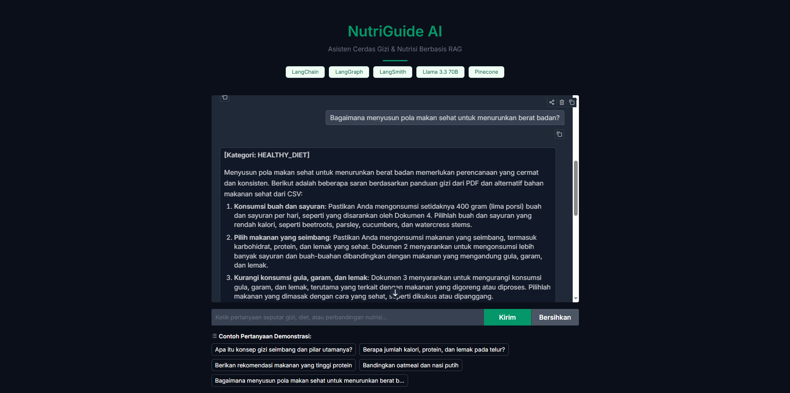
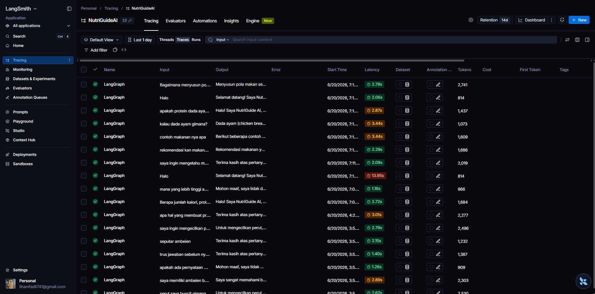
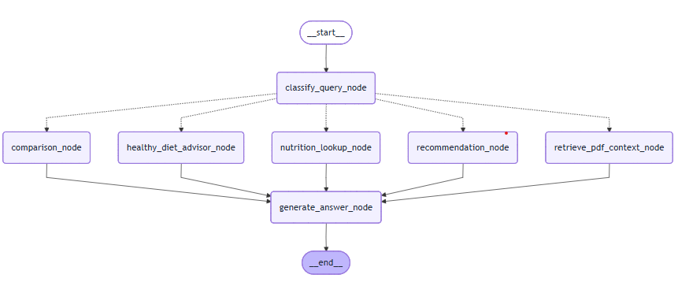

# NutriGuide AI

Asisten nutrisi dan gizi berbasis Retrieval-Augmented Generation (RAG) yang dirancang sebagai sistem pakar kelas produksi. Aplikasi ini menggunakan arsitektur modular berbasis agentic workflow untuk menjawab berbagai persoalan nutrisi, diet, dan gizi dengan akurasi tinggi.

## Teknologi yang Digunakan

Proyek ini dibangun menggunakan stack teknologi:

- **LangChain** — framework utama penghubung pipeline RAG (Retrieval-Augmented Generation)
- **LangGraph** — manajer alur cerdas untuk agentic workflow dan multi-flow routing
- **LangSmith** — sistem monitoring, tracing, dan pemantauan token berstandar industri
- **Llama 3.3 70B Versatile** — Large Language Model (LLM) yang dihosting melalui Groq LPU
- **Pinecone** — vector database berbasis cloud untuk pencarian semantik dokumen PDF
- **Sentence-Transformers** — model embedding (`paraphrase-multilingual-MiniLM-L12-v2`)
- **Gradio** — framework antarmuka web interaktif

## Tampilan Sistem

### Gradio Web Interface

Antarmuka pengguna NutriGuide AI berbasis Gradio.



### LangSmith Tracing

Log pelacakan eksekusi agen pada dashboard LangSmith.



## Arsitektur Sistem

Berikut adalah diagram alur sistem NutriGuide AI yang menggambarkan bagaimana LangGraph merutekan setiap query pengguna ke node yang sesuai.



Setiap query yang masuk pertama kali diproses oleh classify query node untuk menentukan kategori pertanyaan. Berdasarkan hasil klasifikasi, sistem secara dinamis memilih satu dari lima jalur yang tersedia yaitu retrieve pdf context, nutrition lookup, recommendation, comparison, atau healthy diet advisor. Setelah jalur yang sesuai selesai mengumpulkan konteks, semua jalur bertemu di generate answer node untuk menghasilkan jawaban akhir melalui LLM.

Berikut adalah ketentuan masing" Jalur:

|         Jalur         |                   Deskripsi                       |               Contoh Pertanyaan                   |
|-----------------------|---------------------------------------------------|---------------------------------------------------|
| NUTRITIONAL_QA        | Menjawab pertanyaan teori/konsep gizi dari PDF    | "Apa itu gizi seimbang?", "Apa manfaat serat?"    |
| FOOD_LOOKUP           | Mencari data nutrisi makanan spesifik dari CSV    | "Berapa kalori telur?"                            |
| FOOD_RECOMMENDATION   | Merekomendasikan makanan dari CSV                 | "Rekomendasi makanan tinggi protein"              |
| NUTRITION_COMPARISON  | Membandingkan dua makanan dari CSV                | "Bandingkan oatmeal dan nasi putih"               |
| HEALTHY_DIET          | Gabungan PDF + CSV untuk saran diet               | "Bagaimana menyusun menu diet sehat?"             |


## Cara Menjalankan

### 1. Instalasi dependensi

Pastikan berada di dalam folder proyek, lalu jalankan:

```bash
pip install -r requirements.txt
```

### 2. Memuat data ke Pinecone (ingestion)

Sebelum aplikasi dapat menjawab pertanyaan dari dokumen PDF, data harus diubah menjadi vektor dan diunggah ke Pinecone terlebih dahulu:

```bash
python ingest.py
```

Tunggu hingga proses selesai dan muncul konfirmasi keberhasilan upload.

### 3. Menjalankan aplikasi

Setelah data berhasil diunggah, jalankan server Gradio:

```bash
python app.py
```

Buka URL yang muncul di terminal (contoh: `http://127.0.0.1:7860`) pada browser untuk menggunakan aplikasi.

---

## Contoh Pertanyaan

Berikut contoh pertanyaan yang dapat digunakan untuk mendemonstrasikan setiap fitur sistem:

|        Fitur          |                     Contoh pertanyaan                                 |
|-----------------------|-----------------------------------------------------------------------|
| RAG dari dokumen PDF  | "Apa itu konsep gizi seimbang dan pilar utamanya?"                    |
| Lookup data nutrisi   | "Berapa jumlah kalori, protein, dan lemak pada telur?"                |
| Rekomendasi makanan   | "Berikan rekomendasi makanan yang tinggi protein"                     |
| Perbandingan nutrisi  | "Bandingkan kandungan nutrisi oatmeal dan nasi putih"                 |
| Panduan diet sehat    | "Bagaimana menyusun pola makan sehat untuk menurunkan berat badan?"   |
